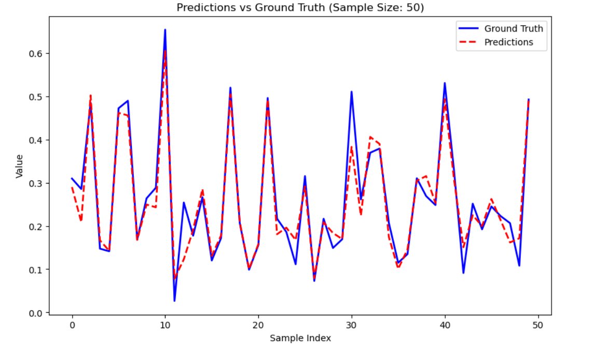

# Power Consumption prediction

## Overview 
This project aims to predict future power consumption using advanced machine learning models such as **LSTM**, **GRU**, and **Transformer**. Accurate power consumption forecasts can improve energy management, reduce operating costs, and improve grid stability in various zones. The dataset contains 52,416 observations collected over 10-minute intervals, and each observation has 9 feature columns describing energy usage and relevant factors. 
Additional info on the dataset can be found [HERE](https://www.kaggle.com/datasets/fedesoriano/electric-power-consumption).  

Date of creation: August, 2024 <br/>

##  Model Selection 
- **LSTM (Long Short-Term Memory)**: LSTM models are well-suited for long-term dependencies in time series data by mitigating the vanishing gradient problem. They excel in capturing both short and long-term trends. 
- **GRU (Gated Recurrent Units)**: GRUs are a simpler alternative to LSTM, with fewer parameters and faster training times. They balance the performance and complexity trade-off in time series forecasting. 
- **Transformer**: With its self-attention mechanism, the Transformer model is highly effective in modeling long-range dependencies in time series data. It scales well with large datasets and can learn complex temporal relationships.


## Quickstart

1. Clone the repository:
    ```bash
    git clone https://github.com/AStroCvijo/Power_Consumption_Prediction
    ```

2. Download the [Electric Power Consumption dataset](https://www.kaggle.com/datasets/fedesoriano/electric-power-consumption), extract it, and paste the `.csv` file into the `Power_Consumption_Prediction/data` directory.

3. Navigate to the project directory:
    ```bash
    cd Power_Consumption_Prediction
    ```

4. Create a virtual environment:
    ```bash
    python -m venv venv
    ```

5. Activate the virtual environment:
    - **Linux/macOS**:
      ```bash
      source venv/bin/activate
      ```
    - **Windows**:
      ```bash
      venv\Scripts\activate
      ```

6. Install the required packages:
    ```bash
    pip install -r requirements.txt
    ```

7. Train the model using the default settings:
    ```bash
    python main.py --train
    ```


## Arguments guide 

### Training arguments
`-t or --train` specify you want to train the model  
`-e or --epochs` number of epochs in training  
`-lr or --learning_rate` learning rate in training  

### Data arguments
`-sl or --sequence_length` length of the sequences extracted from the data  
`-ps or --prediction_step` how far in the future to predict (1 = 10min, 10 = 100min)  
`-pt or --prediction_target` which of the three zones' power consumption to predict: `PowerConsumption_Zone1`, `PowerConsumption_Zone2`, or `PowerConsumption_Zone3`

### Model arguments
`-m or --model` followed by the model you want to use: `LSTM`, `GRU`, or `Transformer`  
`-mn or --model_name` followed by the name of the model you want to use  
`-l or --load` followed by the path to the model you want to load  

#### LSTM and GRU specific arguments
`-hs or --hidden_size` size of the hidden layer in the LSTM or GRU models  
`-nl or --number_of_layers` number of layers in the LSTM or GRU models  

#### Transformer specific arguments
`-md or --model_dimensions` dimensions of the Transformer model  
`-ah or --attention_heads` number of attention heads in the Transformer model

## How to Use

 ### Training Example: 
`python main.py --train --model LSTM --epochs 10 --learning_rate 0.001 --sequence_length 60 --prediction_step 10 --prediction_target PowerConsumption_Zone3 --hidden_size 100 --number_of_layers 3`

### Loading a Pre-Trained Model example
`python main.py --load pretrained_models/LSTM_model.pth --model LSTM --sequence_length 60 --prediction_step 10 --prediction_target PowerConsumption_Zone3 --hidden_size 100 --number_of_layers 3`

## Model Performance
 The models were evaluated based on the following metrics: 
 - **Test Loss**: Indicates how well the model performs on unseen data.
 - **Mean Squared Error (MSE)**: Punishes larger errors by squaring the differences. 
 - **Mean Absolute Error (MAE)**: Measures the average magnitude of errors in predictions. 
 
| Model | Test Loss | MSE | MAE|
|--------------|-----------|-------|-------|
| LSTM | 0.0009 | 0.0011| 0.1735| 
| GRU | 0.0012 | 0.0009| 0.1718 | 
| Transformer | 0.0136| 0.0138| 0.1934|

#### LSTM (Long Short-Term Memory)
The LSTM model performed the best, achieving the lowest test loss (0.0009) and a competitive MAE (0.0011). This suggests that LSTM effectively captured both short and long-term dependencies, leading to accurate predictions of power consumption. 
 
#### GRU (Gated Recurrent Units)
GRU also showed strong performance, with a slightly higher test loss (0.0012) than LSTM but the lowest MAE (0.0009) and MSE (0.1718). This indicates GRU is highly efficient in reducing prediction errors and is a strong alternative to LSTM. 

#### Transformer
The Transformer model struggled with this task, showing a significantly higher test loss (0.0136), MAE (0.0138), and MSE (0.1934). This may be due to the model's complexity and its need for more data to fully utilize its attention mechanism.

## Visualization

Predictions vs ground truth data for **PowerConsumption_Zone3**, forecasting 10 hours in advance.

  
*Test Loss*: 0.0010  
*Mean Absolute Error (MAE)*: 0.1742  

**Model Details**:  
- **Model**: LSTM  
- **Hidden Size**: 75  
- **Number of Layers**: 2  
- **Epochs**: 5  
- **Learning Rate**: 0.001  

## Folder Tree

```
Power_Consumption_Prediction
├── data
│   ├── data_functions.py     # Contains functions for data preprocessing, loading, and transformation
│   └── powerconsumption.csv  # The dataset file
├── models
│   ├── GRU.py                # GRU model implementation
│   ├── LSTM.py               # LSTM model implementation
│   └── Transformer.py        # Transformer model implementation
├── pretrained_models         # Directory for saving and loading pre-trained models
├── train
│   ├── evaluation.py         # Script to evaluate model performance
│   └── train.py              # Script to train and save models
├── utils
│   └── argparser.py          # Contains argument parsing logic for CLI inputs
└── main.py                  # Main script to run the project
```

## References

fedesoriano. (August 2022). Electric Power Consumption. Retrieved [Date Retrieved] from https://www.kaggle.com/datasets/fedesoriano/electric-power-consumption.
